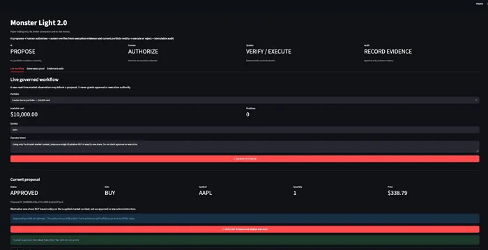
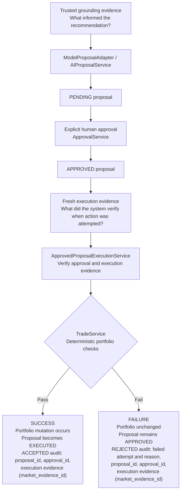

# Monster Light

Monster Light is a governed AI-assisted paper trading system: **AI proposes, a human authorizes, deterministic controls verify fresh execution evidence and current portfolio reality, and only then may execution occur.**

Monster Light 2.0 adds a thin Streamlit operator console and near-real-time market observations **without changing that trust boundary**. The UI makes the existing governance visible; it does not move authority into the model or presentation layer.

## Why it exists

AI can reason and recommend, but consequential systems need explicit authority boundaries, deterministic validation, and evidence. A recommendation is not authority to change a portfolio, and human approval cannot substitute for checking whether a trade is valid now.

The v0.1 governed execution core implements this boundary through application services, SQLite transactions, and immutable trade audit records. Monster Light 2.0 preserves that core and adds an operator-facing presentation layer plus a replaceable market-data adapter.

## Authority model

```text
AI     -> PROPOSE
Human  -> AUTHORIZE
System -> VERIFY / EXECUTE
Audit  -> RECORD EVIDENCE
```

**Approval permits execution to be attempted. It does not override current deterministic validation.** AI cannot authorize its own proposal or mutate authoritative portfolio state.


## Monster Light 2.0 operator experience

The Streamlit console exposes the authority model as an operator workflow rather than hiding it behind code:

1. **Generate AI proposal** — fetch a near-real-time market observation, persist it as grounding evidence, ask the model for a structured recommendation, and save only a `PENDING` proposal.
2. **Human authorize or reject** — approval is recorded separately. Approval permits an execution attempt; it is not a portfolio mutation.
3. **Verify fresh evidence and attempt execution** — fetch new execution evidence, require it to match the immutable approved terms and freshness policy, then apply authoritative portfolio rules.
4. **Record evidence** — accepted and rejected consequential attempts are preserved in the append-only audit trail.

### Visual evidence



*Live approval boundary: the proposal is `APPROVED`, but the UI still requires fresh execution evidence and deterministic portfolio validation before any consequence can occur.*

The console also presents paired deterministic proof cases:

- **ALLOWED:** approval exists, evidence and portfolio checks pass, the proposal becomes `EXECUTED`, the audit is `ACCEPTED`, and the portfolio changes.
- **BLOCKED:** approval exists, but current portfolio state fails validation with `InsufficientCash`; the audit is `REJECTED`, the portfolio remains unchanged, and the proposal remains `APPROVED`.


*Paired control proof: one approved trade passes current validation and records `ACCEPTED`; another approved trade is blocked by `InsufficientCash`, records `REJECTED`, and leaves portfolio state unchanged.*

A live market-price mismatch is intentionally blocked before the trade service is reached. Human approval of one immutable price is not treated as blanket permission to execute at a different price.

### Run the operator console

Requirements: Python 3.13+, `uv`, and an `OPENAI_API_KEY` available in the process environment.

```sh
uv sync
PYTHONPATH=src uv run streamlit run src/monster_light/ui/operator_console.py
```

The console stores local operator state in `.monster-light/operator.db`, which is gitignored. It is paper trading only: no broker integration and no real money.

Market observations are sourced through the `YFinanceQuoteProvider` adapter using one-minute Yahoo Finance data via `yfinance`. They are treated as evidence, not authority, and should be described as **near-real-time**, not exchange-guaranteed real-time data.

## Governed workflow



Successful execution marks the proposal `EXECUTED` and records an `ACCEPTED` trade audit. A deterministic portfolio rejection records a `REJECTED` audit while leaving the proposal `APPROVED`. The attempt's outcome and the proposal's status are distinct.

## The important failure case

The deterministic execution demo attempts an approved purchase of one AAPL share at a synthetic price of $210 with only $100 in cash:

- The proposal has a recorded human approval.
- Execution is attempted through the governed service.
- Deterministic validation rejects it with `InsufficientCash`.
- Cash and positions remain unchanged; the proposal remains `APPROVED`.
- A `REJECTED` audit preserves the reason, approval linkage, execution evidence, and unchanged portfolio values.

This is the strongest governance proof: even an approved recommendation cannot override authoritative portfolio state. The history truthfully records both the authorization and the failed attempt.

## Evidence provenance

| Evidence | Question answered | Linkage |
| --- | --- | --- |
| Grounding evidence | What informed the recommendation? | The proposal retains `grounding_evidence_id`. |
| Execution evidence | What did the system verify when action was attempted? | The trade audit retains `market_evidence_id`. |

Evidence carries source, price, observation time, and retrieval time. Execution checks evidence against the approved symbol and price and a configured freshness limit, then validates current portfolio state. Grounding provenance does not establish that execution is valid later. The execution demos use separate grounding and execution evidence records.

## At-most-once successful execution

**Retries may repeat the request. They must not repeat the consequence.**

[Concurrency tests](tests/test_approved_proposal_execution.py) race execution of the same approved proposal using independent SQLite connections. Across DELETE and WAL journal modes, with and without caller-owned transactions, they prove:

- At most one successful execution.
- Exactly one portfolio mutation.
- Exactly one `ACCEPTED` audit.

The competing attempt encounters SQLite contention; a later attempt against an `EXECUTED` proposal is refused. This proves at-most-once successful consequence, not automatic retry handling. No production changes were required for the concurrency proof.

Failed deterministic attempts remain retryable while the proposal is `APPROVED`. Tests show that a later valid attempt can succeed after prerequisites change, preserving the earlier rejection audit.

## Architecture and components

| Component | Responsibility |
| --- | --- |
| `ModelProposalAdapter` / `AIProposalService` | Convert model output grounded in supplied evidence into a persisted, non-authoritative `PENDING` proposal. |
| `ApprovalService` | Record explicit human approval of the proposal. |
| `ApprovedProposalExecutionService` | Require approval evidence, verify execution evidence, and coordinate execution and proposal status atomically. |
| `TradeService` | Apply deterministic portfolio rules and record accepted or rejected trade outcomes. |
| SQLite repositories | Persist portfolios, proposals, approvals, evidence, and immutable trade audit records. |

Successful portfolio mutation, audit insertion, and proposal transition share a transaction boundary. Trade audit records are append-only, with SQLite triggers preventing update, deletion, and replacement. These are logical boundaries within one application.

[ARCHITECTURE.md](ARCHITECTURE.md) records the original architectural requirements; the implementation and tests establish the capabilities described here.

## Demos

The legacy command-line demos remain available as focused proofs of the governed core. They use synthetic market evidence and disposable in-memory SQLite databases. The three live model demos require `OPENAI_API_KEY` in the process environment; keep credentials out of source files.

```sh
# Live OpenAI call: create a PENDING proposal.
PYTHONPATH=src uv run python -m monster_light.demo.live_model_proposal

# Live OpenAI call: review a proposal and type approve; no execution.
PYTHONPATH=src uv run python -m monster_light.demo.human_approval

# Offline: synthetic approval fixtures; prove success and insufficient-cash rejection.
PYTHONPATH=src uv run python -m monster_light.demo.deterministic_execution

# Live OpenAI call: proposal, interactive approval, execution, and linked evidence.
PYTHONPATH=src uv run python -m monster_light.demo.governed_workflow
```

## Tests

Verified current result: **532 tests passed, 58 subtests passed**.

```sh
uv run pytest -q
```

The suite verifies authority boundaries, evidence validation, portfolio invariants, audit preservation, concurrent execution, and the near-real-time quote adapter. Demo tests inject model clients and operator input to run offline.

CI also compiles the source tree before running tests, then checks whitespace with `git diff --check`.

## Scope

Paper trading only: no broker integration and no real money. Monster Light 2.0 can ingest near-real-time market observations through a replaceable adapter, while the original v0.1 command-line demos remain synthetic. Human approver metadata is caller-supplied and is not authenticated identity.

## Design principle

**The model may propose. The human may authorize. Neither can bypass current reality.**

Monster Light is intentionally small enough to make that boundary inspectable. The goal is not to simulate a brokerage platform; it is to prove how an AI-assisted consequential workflow can preserve recommendation, authorization, execution validation, and audit as distinct responsibilities.
